  
  
  
  

## 🛠️ Tech Stack

**Frontend**

  &nbsp;&nbsp;
  <picture><source media="(prefers-color-scheme: dark)" srcset="https://cdn.simpleicons.org/nextdotjs/ffffff" /></picture>&nbsp;&nbsp;
  &nbsp;&nbsp;
  &nbsp;&nbsp;
  &nbsp;&nbsp;
  

**Backend & Data**

  &nbsp;&nbsp;
  <picture><source media="(prefers-color-scheme: dark)" srcset="https://cdn.simpleicons.org/flask/ffffff" /></picture>&nbsp;&nbsp;
  &nbsp;&nbsp;
  &nbsp;&nbsp;
  &nbsp;&nbsp;
  &nbsp;&nbsp;
  &nbsp;&nbsp;
  

**Tools & Automation**

  &nbsp;&nbsp;
  <picture><source media="(prefers-color-scheme: dark)" srcset="https://cdn.simpleicons.org/github/ffffff" /></picture>&nbsp;&nbsp;
  &nbsp;&nbsp;
  &nbsp;&nbsp;
  &nbsp;&nbsp;
  <picture><source media="(prefers-color-scheme: dark)" srcset="https://api.iconify.design/mdi/brain.svg?color=%23A78BFA&amp;height=42" /></picture>

## 🚀 Featured Projects

<table>
  <thead>
    <tr>
      <th align="left">Project</th>
      <th align="left">Description</th>
      <th align="left">Stack</th>
      <th align="left">Links</th>
    </tr>
  </thead>
  <tbody>
    <tr>
      <td><b>✒️ Tattoo Artist Portfolio</b></td>
      <td>Multilingual portfolio site to showcase a tattoo artist's work, focused on performance and SEO.</td>
      <td>Next.js · TypeScript · i18n · Tailwind</td>
      <td><a href="https://larissa-s-portifoli.vercel.app/en">Demo</a> · <a href="https://github.com/rafaelazzolini1/Larissa-s-Portifoli">Code</a></td>
    </tr>
  </tbody>
  <tbody>
    <tr>
      <td><b>🕰️ Time Tracking System</b></td>
      <td>Clock-in/out registration and shift management with reports — automating a previously manual process.</td>
      <td>Python · SQL · Automation</td>
      <td><a href="https://ponto-system.vercel.app/login">Demo</a> · <a href="https://github.com/rafaelazzolini1/Ponto-System">Code</a></td>
    </tr>
  </tbody>
  <tbody>
    <tr>
      <td><b>🤖 RAG AI Agent for HR</b></td>
      <td>Retrieval-Augmented Generation agent that automates controlled access to HR data, cutting operational demand by 34%. Final degree project.</td>
      <td>Python · RAG · LLM · Flask</td>
      <td><a href="https://github.com/rafaelazzolini1">Code</a></td>
    </tr>
  </tbody>
</table>

---

> *"I like to see code running, turning complex things into simple ones"*
